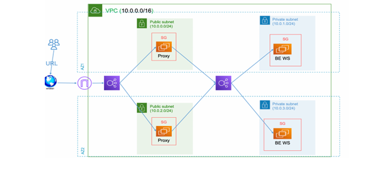

# Project Overview

This Terraform project is designed to create an infrastructure with multiple EC2 instances and two load balancers, as illustrated in the provided diagram. 

#### The infrastructure consists of :

1. A Virtual Private Cloud (VPC) with public and private subnets.
1. EC2 instances configured as web servers in the private subnets.
3. A proxy server in the public subnets that routes traffic to the private web servers..
4. Two load balancers:
-  Public load balancer:  that forwards traffic to the proxy server.
-  Private load balancer :  that forwards traffic to the backend EC2 web servers.

#### This project utilizes AWS services, including EC2, Elastic Load Balancers (ELB), and S3 for storing Terraform state files.

## S3 : 

## VPC : 

## Subnets : 

##  Internet GateWay : 

## EC2 Instances:

## Load Balancers:

## SSH to Bastion Host:

